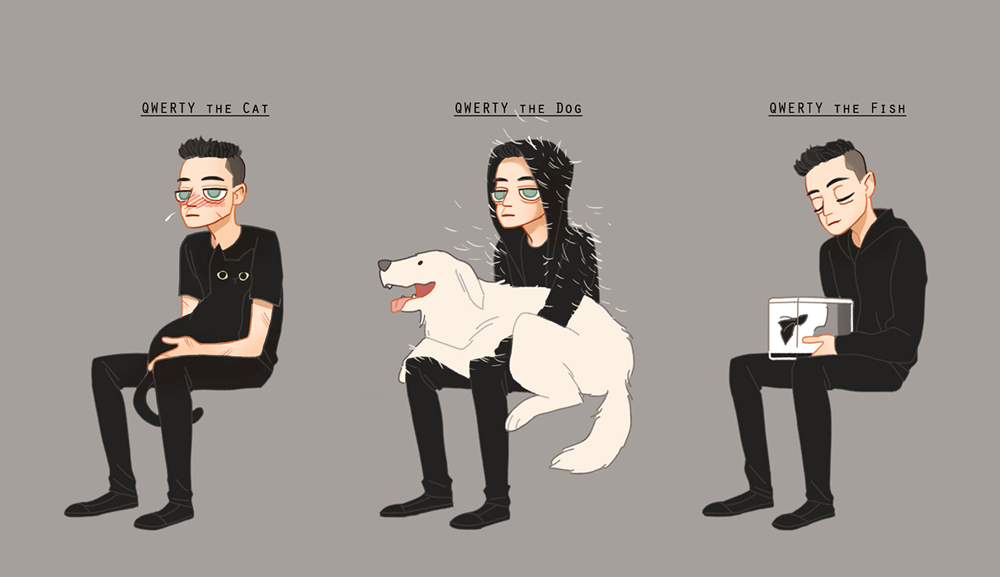

<h2>Hey there! I'm Nidal Bakir</h2>

### 👨🏻‍💻 &nbsp;About Me

✨ &nbsp;I'm a mobile app developer with +3 years of experience using <a href="https://flutter.dev/">Flutter.</a>\
🏹 &nbsp;I'm also learning to develop server services and backends using <a href="https://go.dev/">Go lang.</a>\
🏹 &nbsp;Determined to take the <a href="https://github.com/parse-community/Parse-SDK-Flutter">Parse-SDK-Flutter</a>
to next level.\
💡 &nbsp;I like exploring new technologies, designing patterns, and developing software solutions.\
🌱 &nbsp;I'm on track to learning more about Software Architect, Systems Design, and Backend Engineering.\
✍️ &nbsp;In my free time, I read books about software, Contribute to open-source projects, and maintain Flutter packages.\
🏹 &nbsp;Maintainer and Founder of <a href="https://github.com/mobile-open-chat"> mobile open chat</a> org.\
💬 &nbsp;Feel free to reach out for consulting and volunteering or just for some interesting discussion.\
✉️ &nbsp;You can send me an email at nidal.bakir.edu@gmail.com! I'll try to respond as soon as I can.\
🙌 &nbsp;By the way take a look at my<a href="https://gist.github.com/Nidal-Bakir"> GitHub-gist</a> surely you will find something useful.
<!-- 📄 &nbsp;Please have a look at my [Resume]() for more details about me. I'm open to feedback and suggestions! -->

### 🛠 &nbsp;Tech Stack

&nbsp;

\
&nbsp;
![Java](https://img.shields.io/badge/-Java-05122A?style=flat&logo=data:image/svg%2bxml;base64,PD94bWwgdmVyc2lvbj0iMS4wIiBlbmNvZGluZz0iVVRGLTgiIHN0YW5kYWxvbmU9Im5vIj8+CjxzdmcKICAgcm9sZT0iaW1nIgogICB2aWV3Qm94PSIwIDAgMjQgMjQiCiAgIHZlcnNpb249IjEuMSIKICAgaWQ9InN2ZzEiCiAgIHNvZGlwb2RpOmRvY25hbWU9ImphdmEuc3ZnIgogICBpbmtzY2FwZTp2ZXJzaW9uPSIxLjMuMiAoMDkxZTIwZSwgMjAyMy0xMS0yNSkiCiAgIHhtbG5zOmlua3NjYXBlPSJodHRwOi8vd3d3Lmlua3NjYXBlLm9yZy9uYW1lc3BhY2VzL2lua3NjYXBlIgogICB4bWxuczpzb2RpcG9kaT0iaHR0cDovL3NvZGlwb2RpLnNvdXJjZWZvcmdlLm5ldC9EVEQvc29kaXBvZGktMC5kdGQiCiAgIHhtbG5zPSJodHRwOi8vd3d3LnczLm9yZy8yMDAwL3N2ZyIKICAgeG1sbnM6c3ZnPSJodHRwOi8vd3d3LnczLm9yZy8yMDAwL3N2ZyIKICAgeG1sbnM6cmRmPSJodHRwOi8vd3d3LnczLm9yZy8xOTk5LzAyLzIyLXJkZi1zeW50YXgtbnMjIgogICB4bWxuczpjYz0iaHR0cDovL2NyZWF0aXZlY29tbW9ucy5vcmcvbnMjIgogICB4bWxuczpkYz0iaHR0cDovL3B1cmwub3JnL2RjL2VsZW1lbnRzLzEuMS8iPgogIDxkZWZzCiAgICAgaWQ9ImRlZnMxIiAvPgogIDxzb2RpcG9kaTpuYW1lZHZpZXcKICAgICBpZD0ibmFtZWR2aWV3MSIKICAgICBwYWdlY29sb3I9IiNmZmZmZmYiCiAgICAgYm9yZGVyY29sb3I9IiM5OTk5OTkiCiAgICAgYm9yZGVyb3BhY2l0eT0iMSIKICAgICBpbmtzY2FwZTpzaG93cGFnZXNoYWRvdz0iMiIKICAgICBpbmtzY2FwZTpwYWdlb3BhY2l0eT0iMCIKICAgICBpbmtzY2FwZTpwYWdlY2hlY2tlcmJvYXJkPSIwIgogICAgIGlua3NjYXBlOmRlc2tjb2xvcj0iI2QxZDFkMSIKICAgICBpbmtzY2FwZTp6b29tPSIzMy42NjY2NjciCiAgICAgaW5rc2NhcGU6Y3g9IjExLjk4NTE0OSIKICAgICBpbmtzY2FwZTpjeT0iMTIiCiAgICAgaW5rc2NhcGU6d2luZG93LXdpZHRoPSIxOTIwIgogICAgIGlua3NjYXBlOndpbmRvdy1oZWlnaHQ9IjEwMTEiCiAgICAgaW5rc2NhcGU6d2luZG93LXg9IjAiCiAgICAgaW5rc2NhcGU6d2luZG93LXk9IjAiCiAgICAgaW5rc2NhcGU6d2luZG93LW1heGltaXplZD0iMSIKICAgICBpbmtzY2FwZTpjdXJyZW50LWxheWVyPSJzdmcxIiAvPgogIDx0aXRsZQogICAgIGlkPSJ0aXRsZTEiPkphdmE8L3RpdGxlPgogIDxwYXRoCiAgICAgZD0iTTguODUxIDE4LjU2cy0uOTE3LjUzNC42NTMuNzE0YzEuOTAyLjIxOCAyLjg3NC4xODcgNC45NjktLjIxMSAwIDAgLjU1Mi4zNDYgMS4zMjEuNjQ2LTQuNjk5IDIuMDEzLTEwLjYzMy0uMTE4LTYuOTQzLTEuMTQ5TTguMjc2IDE1LjkzM3MtMS4wMjguNzYxLjU0Mi45MjRjMi4wMzIuMjA5IDMuNjM2LjIyNyA2LjQxMy0uMzA4IDAgMCAuMzg0LjM4OS45ODcuNjAyLTUuNjc5IDEuNjYxLTEyLjAwNy4xMy03Ljk0Mi0xLjIxOE0xMy4xMTYgMTEuNDc1YzEuMTU4IDEuMzMzLS4zMDQgMi41MzMtLjMwNCAyLjUzM3MyLjkzOS0xLjUxOCAxLjU4OS0zLjQxOGMtMS4yNjEtMS43NzItMi4yMjgtMi42NTIgMy4wMDctNS42ODggMC0uMDAxLTguMjE2IDIuMDUxLTQuMjkyIDYuNTczTTE5LjMzIDIwLjUwNHMuNjc5LjU1OS0uNzQ3Ljk5MWMtMi43MTIuODIyLTExLjI4OCAxLjA2OS0xMy42NjkuMDMzLS44NTYtLjM3My43NS0uODkgMS4yNTQtLjk5OC41MjctLjExNC44MjgtLjA5My44MjgtLjA5My0uOTUzLS42NzEtNi4xNTYgMS4zMTctMi42NDMgMS44ODcgOS41OCAxLjU1MyAxNy40NjItLjcgMTQuOTc3LTEuODJNOS4yOTIgMTMuMjFzLTQuMzYyIDEuMDM2LTEuNTQ0IDEuNDEyYzEuMTg5LjE1OSAzLjU2MS4xMjMgNS43Ny0uMDYyIDEuODA2LS4xNTIgMy42MTgtLjQ3NyAzLjYxOC0uNDc3cy0uNjM3LjI3Mi0xLjA5OC41ODdjLTQuNDI5IDEuMTY1LTEyLjk4Ni42MjMtMTAuNTIyLS41NjggMi4wODItMS4wMDYgMy43NzYtLjg5MiAzLjc3Ni0uODkyTTE3LjExNiAxNy41ODRjNC41MDMtMi4zNCAyLjQyMS00LjU4OS45NjgtNC4yODUtLjM1NS4wNzQtLjUxNS4xMzgtLjUxNS4xMzhzLjEzMi0uMjA3LjM4NS0uMjk3YzIuODc1LTEuMDExIDUuMDg2IDIuOTgxLS45MjggNC41NjIgMC0uMDAxLjA3LS4wNjIuMDktLjExOE0xNC40MDEgMHMyLjQ5NCAyLjQ5NC0yLjM2NSA2LjMzYy0zLjg5NiAzLjA3Ny0uODg4IDQuODMyLS4wMDEgNi44MzYtMi4yNzQtMi4wNTMtMy45NDMtMy44NTgtMi44MjQtNS41MzkgMS42NDQtMi40NjkgNi4xOTctMy42NjUgNS4xOS03LjYyN005LjczNCAyMy45MjRjNC4zMjIuMjc3IDEwLjk1OS0uMTUzIDExLjExNi0yLjE5OCAwIDAtLjMwMi43NzUtMy41NzIgMS4zOTEtMy42ODguNjk0LTguMjM5LjYxMy0xMC45MzcuMTY4IDAtLjAwMS41NTMuNDU3IDMuMzkzLjYzOSIKICAgICBpZD0icGF0aDEiCiAgICAgc3R5bGU9ImZpbGw6I2ZmZmZmZiIgLz4KICA8bWV0YWRhdGEKICAgICBpZD0ibWV0YWRhdGExIj4KICAgIDxyZGY6UkRGPgogICAgICA8Y2M6V29yawogICAgICAgICByZGY6YWJvdXQ9IiI+CiAgICAgICAgPGRjOnRpdGxlPkphdmE8L2RjOnRpdGxlPgogICAgICA8L2NjOldvcms+CiAgICA8L3JkZjpSREY+CiAgPC9tZXRhZGF0YT4KPC9zdmc+Cg==)&nbsp;
\
![ReactiveX](https://img.shields.io/badge/-ReactiveX-05122A?style=flat&logo=data:image/png;base64,iVBORw0KGgoAAAANSUhEUgAAADAAAAAwCAYAAABXAvmHAAAABmJLR0QA/wD/AP+gvaeTAAAJnUlEQVRo3uWZe3BU9RXHP+e+NgkhD2IURYrxRUS0I6bQcVSGwepopWpVqlQR2460gpBQHJ3a6jpVLIp5IBRp/9Dp1EdxoB0Va1OF2hlofT+g1IqaULGKaCAIeezuvad/3N8md292kQZIO9M785vffe3d7/e8fuecHxzkoTSOUJqOVlT4LxwyeODN5wL3A3XmVi+wFnhQqP/jUBGwBgn+AqA1Ah4gAXwTaFValikq60k6/3MaUJomgPwJGA6wD2Ur0rEdPulAnQxabSMlDrgO4ECHjWxz0G028rpD8MxG9ryWJBkMOQGlZQrwW0XLN6PdL8Onu9BRLmK5gBsC7pujw84dOyx4CuSBc6l/67ASUJoqgAlgfQf0yrdRfQbZ04NWZ0HHwecjYseIWOFQgWdBF09kwQuHjIBy/8lg/RTkbOCYrIc+gu5oh6OyIEcAxyHsRtlTgEx0jpIICQhiQCg8oVhzJjBv50ERUJaNgcyrQFX23ocQrER3ZaDKBcqBi4CxBgBAF/A+8D5KOg+ZXHOSPhKSC2Knj95wOg2/O4go5M+Kgt+GppoIunrQKjE/+DpCbQR89kMOipg5ZvMRApJDzjPDEK12kTWbaEoeBAE9MXvWBkEj6gdQKhGJDcvzoS5gO5A2pmH123mEhORoIk7EkBAXuWMzLcsGuw5UAHSiNBPsDaBYIqoWYBM6APw2YE/kHQsdQMLMOx2Cb3jwdFwDuSanc96i5SeDWsh8oBH9rBfKpM9ZpM9pNgFthkQAdAIfAb4xIcu8HyVgGbu3of1EGp620PXxKObGnNxG73yTpisO2ImV5aWQ3rIWrVqDlng56hWi1wmgtA+sDnjuxiTrGds399o8ODa72NlGEBkz0kDKzGn4qAur9qvM27NfDShJDzKPdsDo1ai9P5UljKRSJrz6ETlInjnPqBFws6YVlXz8XeBol+CWK1llz6T59LwElJUlUP4U6LRH0b2ZEGMOqJHAOPDHgY40eYRjJLY7dODeNoJPPobdfhjXjWD2P2fNUAs8C6+Dq59gug9B/Q38rDyHQCj57idBzt8FbESLoi9UAVOR1HigrF9IA+wwgEQXcmQ7WrEedrbBCoX34qDVAA6Mr2VNJmOug9h74W+l5kUeqAFp80ncHtNA5Q+AqQC/R4MAnOwf1iLBhYg/HDzJAzq2CCHwpgXfAh0zm4YbobPWh+sV3g0iwOPgUxESWSJ+jGxP6GvbLXTuTSytzv6nA4zPXjyP9ioUA4xHeqcgXgq1CoGOXO+00Hl30PAbQfosYArJDPDwepK/Hk75BYpc5cMllslks+YjEbB+bAQoAbw0mZvaZtF0hqAepK8AVhgNaBdAO9ABxQocBf5FIBZIASeMpgEvCHz5VhY8HgUfPaaQzNTRsPZ06q/tJDjKh2lp5O40rEsjnZGIE9VC4MOWDLII7K8RhtV0GGKtiRENyAbQea+ifbZ6HdZOG0Zm8gOOnj9XTOe0G0n2HOjSfxYLuoGnzQDgbywvdQiODchUgpVK46c80u2nccvnMXsfHa4pOjpCIGgFSb8HtoJVh3xWCSN7I2Ct/Od/d8hcOvM/AF/oOJU5e4G3v+g9B62xERy0j5glNOwG3noPzShwKbInLuk8JDKgM2dy876hLOBtZJLJZv8JcBctZxkHlY87wD4Sgio4Lp4CDMxnZNXVLHhlKMHfxNJqB84yC966VayybYJ7LCVpKZzSi1gTkTYrdF4KjXAhCFqGun1i41/igu1AV5r0uq18eK0DdRaUz0qhx4PKGdCTD7CVWwruuJiGl4cSfJKk5aI/NHnVr0qwEw7cZ8NeC+TORAjOPwax8wDuq6DCIRsLhcvDdXRTNt2FWheCBEFLEdaDDhzhwMeWyYYZBqkSdJiVW3Tnqaz0X0Mr/eWlLnKXyWIfEuwZLnK5yWzft0AWAYxEegQROw9oO1cLQxp5lN77PPQEF+l0YV8CfhypH9ZZwvxHgdXjQYNwMcwr+UhtWzFU4O+kcZqHzPbCWsP2kHkuSJYASKsJo7tnjIPN+9C9FCzGw5rWhpqhAH8XjRMTyGMeiCk7S73cEvS571L/DytMypKpidjnf458kE3S4h21CIlJStI6nOCXsKS2GFmbgGER0F0uBP3mI/fmVGTCvN4yWNMfdwf2c0wnoWwzFVMPF/hmmid52C94cES2dPWg1YMtHlghGXl8humA50jyWHS1SQb3S8JBbjgc4FfQeFkCXedBhYe8nkCXOchkQ6LOaOKDUrwbC3bmemheA1wW7VBE011zHvQSTDrNpBPbuH9qQNFnNcx541AtXEmSwcO0nOkQPGLDWBPaP0ngT57GwrefpfFUwe2yBpaHwR0Gd14tGBu0EljLXmGlC+Bhj6gi/VIbjZMPBYFxVJc8RvPdxQR/ScDYrOSL0fNeZe87z9L4fRd+cT5z2wcQSLBgE7A8es/NPyaV0b0kXEPmr1bEH4H9fBtNVw8W+CP8vPIJmhbapN5NoD9KgOsBRdBq40/wsI45m/LXEsgKB2upIFqgO714eC+JF4FTiBTk0aopMt92EvWLPqJlWSk6xwc60OXH0zD3QEA/xZIjApwpgl4OTANKIqn8DhtdLNBtId+z4UwTFd/8kFFnTme6X3B/oIeWk0BfBCrjJDKx8i+DNO6i6NYxdLe5MErDnZutKeSc46nfEf/2H2g+V9D5AYwXOFnz95LUgncsOMECx+prINNro1+pCy2l8B5ZEfO3gnVV1B8kTzM2HLpgBN0b9qGzM2hKgSLkpBLYvpXme+LfvoD6P3vo80UwOhsqE5GOnxnihfbveJFnDtyeBX9AOzS9tMxQ9CHzjb4jk2f44AewYRhyjqAS9GutKwUP7yBYaGpiADbSOAq4FWSW6VTmbR5EiqvHTmP3NRLZXzugPbIems4DWUOkHUKktxOfg8gq3t/XUVLI5xl0nY+0gm4J0O0Oru+TrgqQCy24GBgLlPc3DiSbmz25j+Ir6pidHtQmX4qmCQGsARmT6/C5zah4h41Ywyq8r6YlXLjjnFuT6yqHiutquL7nIHcpV5b00n07cHPcf/I3pXLJxRtZX0RAwLfhti8x/95CRdSgduq7WTpZCFYadVOISLyVGMR6pPFmbiwKvS7I3FHM33hIN7oj7Xinh8pvC3pLdL2ImlacRLRpSwEtWPCBIouO5OhfCtP9Q75TPxCoSg/NUyzkmgAukXD3dQCZIDbHpO8DGxRZUUnRaok56mElENdKNyPqLIJzFM4QqDX7zNURn0kDnyq0g7wB+tc0mWfKWPgp/4/HvwH7VnfM8U6IYAAAAABJRU5ErkJggg==)&nbsp;
\
&nbsp;
&nbsp;
&nbsp;
\
\
&nbsp;
-05122A?style=flat&logo=data:image/png;base64,iVBORw0KGgoAAAANSUhEUgAAADEAAAAxCAYAAABznEEcAAAF90lEQVR42s3aA5DkWhTG8Wfbtm3btm3btm2vbdu2bXu3beS8/6md7NztmulOKumduVW/ZTpzv1zkJDMbuW17/Beoyp64BK+iPgZgOpZiBZZgGvqhDl7ChdijqvN5b847vwMux48YhQByEAdyWIMR+BYXYzvvYZx3fmc8gN6IQnwQRnfcjR3dh3EeYDNci97IQMoghW64HJt6DlIQYG/8gBBkA1iDLwvXjJcAp6APpAZ0w3GugxQEuBRTITVoPM4rDOI0wGWYA6kFphUGcRLgdEyD+Gl3279w//kJOKFYEDPA/hgI8cNudHhX7MmfD6oflKMaoXFQDmkQlL3q6P/pMY7P1wN7FoYoDLAFfvfrqmvnTmwWkmf6x6ThtJQMXpqVSatzMnlNTkYsz0rLWWl5Y0hczmoVXvsZZ2G+xWZmkMIQtyHmx9XXK/3W0LhMDeQkZ0m1zcL8SF6+HZOUY5sEnYxKEFebIQrrn6F+BDihaUhaz05r5121foszcm7rsJMgvbGz3XczxLPIewmg0+FI5nzHuWkxWyYvMn5VTupMSclHIxLywfCE/DUpJSNXZCVVkHTIsqyc0jxUKkgGDxaG2B0jIF7syUL9bmxSzG4tjObl9cFxOZrFrMfoQla6Zg4nsK6XmcGcmK0+62ffuiW/Xl+7zjLXQtpLAO3Y5e3DsjyeF7stYK7f0jWyttOoavHr/13VIbJekFDakpu68LnioxHDVXaIzdAA4tXvE5NitzR9emlgnI44uwBP9YtJ0phadaemZM/SX/M3bKwhDsMMr2tBp4tun3Ybytw+rGFQdne4HR/KsfoZu+m5OGepbXc89tUQdyDhdSpd3TEiYaaB3T4bleDf3e1qP4yrHMnVSUsuahsudY4wrtIQ30G82OWfgDzRNyb2bNAd567uUf7d3TleHBhbtynEs5bcXHpdWHhPQ/T0I8Tb3NjsFkxZclk7vYruzvE06yJfkSJJiNu6Rp2co6WGmA3xOp0+ZP+326qEJRe0cRdCj31veOU5ImlLp6iTc4zWEGE/QnxkhFhZEWI3FyH25r7Qhru8uT2f1iLk5ByLNUTOjxAfGyHWJAtHwv09pvuCjOxfL+jk8yENIX6EeJKFPZLKVPWgAw6voh4jhzdcv1TJWc7vMYht5LleqqBlwsENgkqfGyhB9N+rZz9naKneZEZq3YLWNmxZ1sk9whbeyP27o8oHGe24dth2oOGgIvTKa7X6GjXV2JVZMduKRF5u7xZ1s56Waoj5bu7Me3OFr2HX0EKvy/yMPuhwp3VnHBXtUua/ffXNXY2C0PWLBA3Rz2kArTp/nZDUhSt+Ngs6Ind3j7oNoNppiF+dzPv9mDp/T06JX01HgWpVNwJ9vtAHKTdTyGbhEw3xAFKl1oDO02imcgQCKUv3da13mFoJJB37lLrquQExvZnp+tDO2wHciuJGDXEM5kGKMUdBw+jctd9WKC0bdjbwb0VxvP1w5GV7n4KDNMSWaFXs4P3qBaTXwozYbThTQLdSewvcHcc2CXHDiiitPu0bVbnVwaYaQj1Y7M6tHeq7qDLEwCUZOaAeIYzp9s2YhGi9E4Y+C5zczJ7jZZPCzebj6X6YVO2zMxpMS1Vuhcm1FaY9l8+nxJgWMB+IKkaqvKMwHLuZIdQ7xRb2Q72j+pywXoH2L28v/piUlKkEMNsnIxPlHoU8nqvqlc2BmFjdFqt32hYz01KqMQr2dlnuUdjLDGF6HOnqCrXjWLw6rXTeFzZ9yNfKk6lV7gBx3FnsNeZ2aF6s4tSdSl+nfMt+35yRUT+NT8q9PaJyaINguQOof7FVqZfKR2Nikbu3XQCy4FFH/2zu+WWfRgc7ebWvrsQSSC0yF66/0XI3VtaSAItxQ7EAxYPU/IjMcxTAwdSaWEMBRuICv74NfDSam9tvmSVRD4f6/Q357fBYmUfFwmjch63L9aMR6kC8jYnIQnyQwRi8gn035A+q7IsH0BJzkYS4kMBsNMHd2MtD5z0FUVviaNyPX9AX8xA1yvscIpiD3vgRd+MIbO71Z57+BwJkdrrBt/8SAAAAAElFTkSuQmCC)&nbsp;
\
&nbsp;
\
&nbsp;
&nbsp;
&nbsp;
&nbsp;
\
&nbsp;
&nbsp;
\
&nbsp;
&nbsp;

### 📚️ &nbsp;Books I enjoyed reading

&nbsp;
\
&nbsp;
\
&nbsp;
  
### ⚙️ &nbsp;GitHub Analytics

### 🤝🏻 &nbsp;Where to find me

